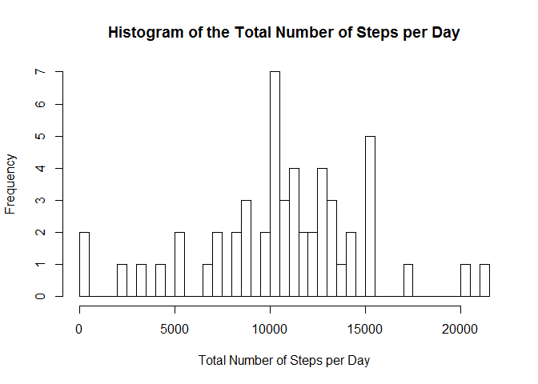
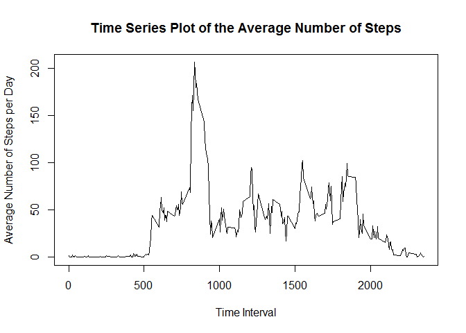
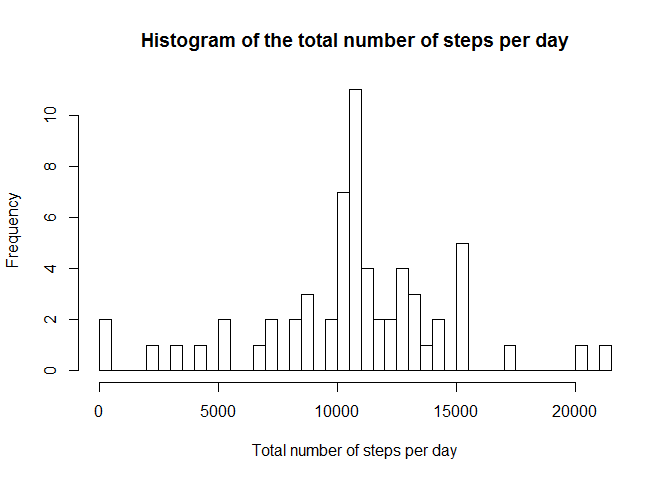
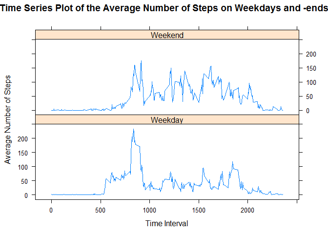

# Reproducible Research: Peer Assessment 1


## Loading and preprocessing the data

###1. Loading the "activity.csv" file.

```r
# Loading the librarys and setting the current working directory
setwd("C:/Users/Nina/Documents/DataScience/Coursera Course/5. Reproducible Research/Project1")
library(dplyr)
```

```
## 
## Attaching package: 'dplyr'
## 
## Die folgenden Objekte sind maskiert von 'package:stats':
## 
##     filter, lag
## 
## Die folgenden Objekte sind maskiert von 'package:base':
## 
##     intersect, setdiff, setequal, union
```

```r
library(lattice)

data <- read.csv("activity.csv")
```


## What is mean total number of steps taken per day?

###1. Calculate the total number of steps taken per day.

```r
# Group the data by date and calculate the sum of steps taken per day
data_A <- group_by(data, date)
data_B <- summarize(data_A, sum(steps))
```


###2. Make a histogram of the total number of steps taken each day.

```r
# Rename the data set data_B
names(data_B) <- c("date", "sum")

# Generate a histogram showing the total number of steps per day
hist(data_B$sum, breaks=61, main=paste("Histogram of the Total Number of Steps per Day"), xlab="Total Number of Steps per Day")
```

 


###3. Calculate and report the mean and median of the total number of steps taken per day

```r
# Remove the missing values
data_C <- na.omit(data_B)

# Calculate mean and median of the total number of steps taken per day
mean <- mean(data_C$sum)
median <- median(data_C$sum)
options(scipen=999)
```

The mean of the total number of steps taken per day is 10766, whereas the corresponding median is 10765.


## What is the average daily activity pattern?

###1. Make a time series plot of the 5-minute interval and the average number of steps taken, averaged across all days.

```r
# Remove the missing values in order to calculate the mean
data_E <- na.omit(data)

# Group the data by the interval and calculate the mean of the steps per interval
data_F <- group_by(data_E, interval)
data_G <- summarize(data_F, mean(steps))

# Make a time series plot
names(data_G) <- c("interval", "stepsAv")
with(data_G, plot(interval, stepsAv, type="l", xlab="Time Interval", ylab="Average Number of Steps per Day", main=paste("Time Series Plot of the Average Number of Steps")))
```

 


###2. Which 5-minute interval, on average across all the days in the dataset, contains the maximum number of steps?

```r
# Find the 5-min interval that contains the maximum number of average steps
data_H <- as.data.frame(data_G)
maximum <- max(data_H$stepsAv)
MaxInterval <- data_H[data_H$stepsAv==maximum,1]
```

The 5-minute time interval 835 contains the maximum number of steps (206).


## Imputing missing values

###1. Calculate and report the total number of missing values in the dataset

```r
# Counts NA in the steps column of data
sumNA <- sum(is.na(data$steps))
```

The total number of missing values is 2304.


###2./3. Fill in all of the missing values in the dataset.

The missing values of the steps variable of the data set are replaced by the mean of the steps averaged over the 5-minute time intervals. As missing values only appeared for a complete date or not at all, indicating that the steps had been measured only on specific dates, no mean value per day could be calculated to replace the missing values. Therefore, replacing by the mean of the steps per 5-minute time interval seemed to be the only strategy that made sense.

```r
# Grouping the dataset by interval and calculating the mean of the steps per interval.
data_I <- group_by(data_E, interval)
data_J <- summarize(data_I, mean(steps))
names(data_J) <- c("interval", "stepsAv")
data_K <- data

# Merging the dataset data_J containing the mean of the steps per interval with the original dataset
data_Z <- merge(data_K, data_J, by.x="interval", by.y="interval", all=TRUE)

# Generating an index my.na based on the missing values in the steps variable
my.na <- is.na(data_Z$steps)

# Generating a new column data_Z$new equalling the original steps column
data_Z$new <- data_Z$steps

# Replacing all missing values in the new column with the values in the stepsAv column, which contains the mean of the steps per 5-min time interval. Using the my.na index for the missing values ensures that entries are replaced by index and only NA values are replaced whereas other values are remained.
data_Z$new[my.na] <- data_Z$stepsAv[my.na]

# Overriding the old steps column with the new column with filled in missing values.
data_Z$steps <- data_Z$new
```


###4. Make a histogram of the total number of steps taken each day and Calculate and report the mean and median total number of steps taken per day.


```r
# Generate a histogram showing the total number of steps per day
data_L <- group_by(data_Z, date)
data_M <- summarize(data_L, sum(steps))
hist(data_M$sum, breaks=61, main=paste("Histogram of the total number of steps per day"), xlab="Total number of steps per day")
```

 

```r
# Calculate mean and median of the total number of steps taken per day
mean2 <- mean(data_M$sum)
median2 <- median(data_M$sum)
```

The mean of the total number of steps taken per day is 10766, whereas the corresponding median is 10766. These values are basically identical to the mean (10766) and the median (10765) calculated from the original dataset excluding all missing values, only the median differs about one point. Concluding, the estimates for the total number of steps per day are not significantly changed upon replacing the missing values by the mean of the steps per 5-min time interval.

However, there are slight differences in the histograms created from the dataset with missing values in comparison with the dataset where the missing values had been replaced by the mean of steps per interval. However, as the mean was chosen in order to replace the missing values, no fundamental changes in the shapes of the historgrams are observed, although the observed normal distribution appears to become narrower/sharper after replacing the values.


## Are there differences in activity patterns between weekdays and weekends?

###1. Create a new factor variable in the dataset with two levels - "weekday" and "weekend"

```r
# Create a factor variable indicating weather a day is a weekday or weekend
data_K$date <- as.Date(data_K$date)
data_K$weekday <- weekdays(data_K$date, abbreviate=TRUE)

data_K[data_K$weekday=="Mo", "weekday"] <- "Weekday"
data_K[data_K$weekday=="Di", "weekday"] <- "Weekday"
data_K[data_K$weekday=="Mi", "weekday"] <- "Weekday"
data_K[data_K$weekday=="Do", "weekday"] <- "Weekday"
data_K[data_K$weekday=="Fr", "weekday"] <- "Weekday"
data_K[data_K$weekday=="Sa", "weekday"] <- "Weekend"
data_K[data_K$weekday=="So", "weekday"] <- "Weekend"

data_K$weekday <- factor(data_K$weekday)
```


###2. Make a panel plot containing a time series plot of the 5-minute interval and the average number of steps taken, averaged across all weekday days or weekend day. 

```r
# Final plot
data_O <- group_by(data_K, weekday, interval)
data_P <- na.omit(data_O)
data_Q <- summarize(data_P, mean(steps))
names(data_Q) <- c("weekday", "interval", "stepsAv")

xyplot(stepsAv ~ interval | weekday, data=data_Q, layout=c(1,2), type="l", xlab="Time Interval", ylab="Average Number of Steps", main="Time Series Plot of the Average Number of Steps on Weekdays and -ends")
```

 
